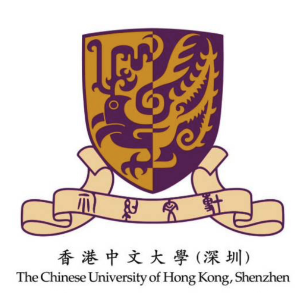

  

# 🌟 Phoenix_CUHKSZ_Knowledge 🌟

## Language / 语言 🌐
<a href="https://github.com/FreedomIntelligence/phoenix_cuhksz_knowledge/tree/main/README.md">中文</a> | <a href="https://github.com/FreedomIntelligence/phoenix_cuhksz_knowledge/tree/main/README_en.md">English</a>

---

## 🇬🇧 English

### 📘 Introduction

**CUHKSZ Knowledge Base** is a comprehensive information collection designed to provide students, alumni, and visitors with detailed data about The Chinese University of Hong Kong, Shenzhen. This knowledge base covers seven main categories ranging from campus landmarks to faculty information, making it an indispensable resource platform.

## 🌟 Index of Information Categories 🌟

| Category No. | Category        | Description                                              |
|--------------|-----------------|----------------------------------------------------------|
| 1            | Landmarks       | Information on important locations within Shenzhen and on campus. |
| 2            | Buildings       | Showcases campus architecture of CUHKSZ, including but not limited to academic buildings, dormitories, cafeterias, and libraries. |
| 3            | Faculty and Staff | Provides information about CUHKSZ faculty and staff, including professors and teaching assistants, detailing their teaching areas and research directions. |
| 4            | Metadata        | Includes basic information such as the history of the school, founding time, and graduation requirements, as well as answers to common student inquiries such as delivery services, standardized testing, and internship opportunities. |
| 5            | Departments     | Detailed introductions to each department, highlighting their features, academic research, and program offerings. |
| 6            | Pronouns        | Explains sensitive pronouns and campus-specific terms used within CUHKSZ. |
| 7            | Majors          | Provides detailed setup information for each college's majors, aiding students in understanding and choosing suitable academic directions. |

#### 📍 Landmarks
In this section, you can find detailed **Landmark Information** involving important locations in Shenzhen and on campus. Whether you want to know about the nearest airports, train stations, subway stations, and bus stops, or about iconic buildings on campus, comprehensive guides are provided here.

#### 🏛️ Building Information
The **Building Information** section showcases the campus architecture of CUHKSZ, including, but not limited to, academic buildings, dormitories, cafeterias, and libraries.

#### 👩‍🏫 Faculty and Staff
This category provides information about CUHKSZ **Faculty and Staff**, from professors to teaching assistants. Here, you can find introductions to each faculty member, learning about their teaching fields and research directions.

#### 📊 Metadata
The **Metadata** section includes basic information about CUHKSZ, such as the history of the university, founding time, and graduation requirements. It also answers common student inquiries about delivery services, standardized testing, and internship opportunities.

#### 🎓 Department Information
This category provides detailed introductions to each department at CUHKSZ, from the School of Business to the Medical School, showcasing their features, academic research, and program offerings.

#### 🗣️ Pronouns
In the **Pronouns** section, you will learn about sensitive pronouns and campus-specific terms used within CUHKSZ, helping you better understand and integrate into campus culture.

#### 📚 Majors
Finally, the **Majors** category offers detailed information about the various majors offered by each school at CUHKSZ, providing valuable resources for your academic and career planning.

### 📝 Contribute to the Knowledge Base
Dear teachers and students, our knowledge base is like a secret diary that is still somewhat blank and urgently needs your 'gossip' to fill it! It's time to dig into your brains and share those campus secrets and valuable wisdom that only you know. Don't let your precious insights just circulate in coffee shop gossip; let them shine in our knowledge base and become legendary stories! Come, join this feast of knowledge, scoop up your exclusive inside stories and academic treasures, and together create a CUHKSZ treasure trove full of surprises and wisdom!

  

